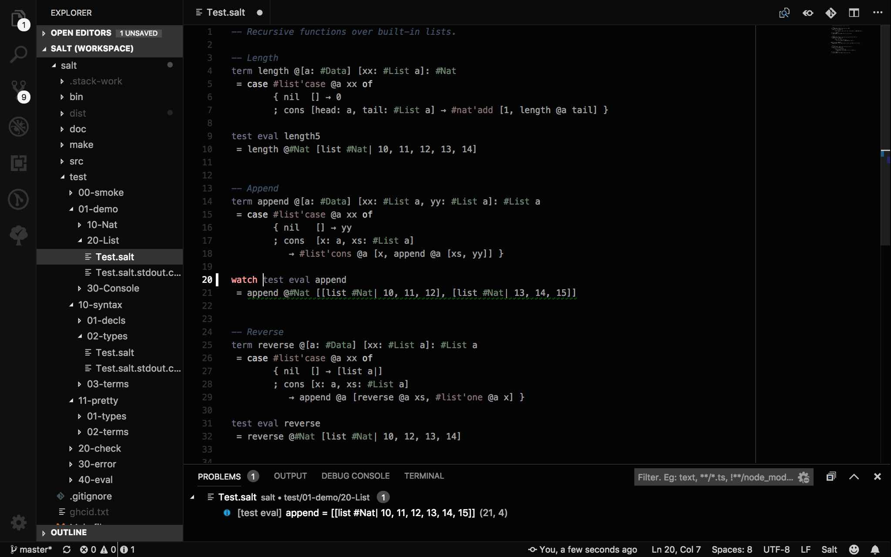
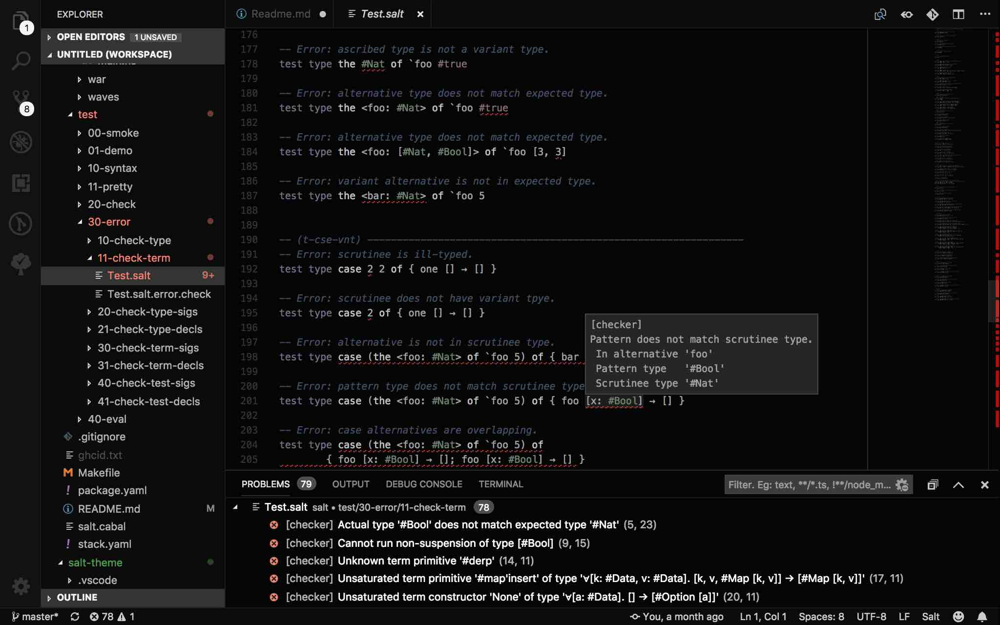

# Salt Visual Studio Code Language Extension

Includes the syntax definition, as well as support for the [Language Server](https://langserver.org/) mode of the [`salt`](https://github.com/discus-lang/salt) executable. You'll need to build/install the [`salt`](https://github.com/discus-lang/salt) executable separately as well as this extension.

You may also want the [Salt Plain Visual Studio Code Theme](https://github.com/discus-lang/salt-theme). This theme knows a bit more about the Salt language syntax than the standard themes, but the standard ones work well enough if you just want to try it out.

## Development
Use VSCode for development of the extension itself. Load the code into a new workspace, select the `src/extension.ts` module and run the `Start Debugging (F5)` command in VSCode. This should open a new VSCode window with the current version of the extension running. After modifing some of the code, use the `Reload` command in the VSCode debug pane to reload the extension in the second window.

## Installation
Once you're happy with the changes, package the extension into a `.vsix` file ready to installed more permanently into VSCode. Use the following commands from the root of the extension source directory. The `vsce` package is the VSCode Extension management command line tool.

```
$ npm install vsce
$ node_modules/.bin/vsce package
$ code --install-extension ./salt-vscode-XX.XX.XX.vsix
```

## Configuration
The extension expects the `salt` executable to be in your path when you start VSCode. If you don't have 'salt' in your path, or want to use a development version, then set the desired path in the 'salt.server.executable' configuration setting in VSCode. You'll need to restart VSCode (and hence the extension) once you've changed this.

## Examples
These examples all use the [Salt Plain Visual Studio Code Theme](https://github.com/discus-lang/salt-theme).

Adding a the `watch` keyword to the front of a test causes the result to appear as an information message in the "Problems" panel.


Demonstration of error diagnostic reporting in the Salt test suite.

